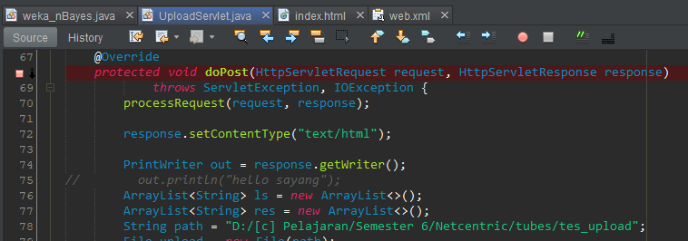

# java-BayesServlet
 
1. Machine learning classification using Naive Bayes by Weka API library using java  
2. It will read CSV file and automatically converts it into arff, but it can also read the arff file directly  
3. It will convert every null value on the inserted CSV file into "?" value so that weka csvLoader can read the CSV file  
4. CSV file is uploaded through a web page served by java servlet, and the result will be shown on the web page 

nB: you need to specify the path where the file will be uploaded. It is located here. 

